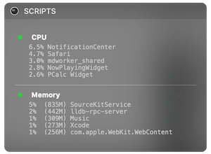

#  Today-Scripts [Megabits fixed ver.]

## This app will not work on macOS Big Sur. Apple killed all old-style widgets on Big Sur, I'm very sad about it.

*A widget for running scripts in the Today View in macOS's Notification Center.*

**Download the app** from [Today Scripts.app.zip](https://github.com/megabitsenmzq/Today-Scripts/releases/download/1.4a/Today.Scripts.app.zip)

Original links and text preserved:  

- [Latest build here from original repo (does not work on new macOS)](https://github.com/SamRothCA/Today-Scripts/releases)
- [See the wiki for a list of example scripts.](https://github.com/SamRothCA/Today-Scripts/wiki)

### Features

* [Colorized Output](http://i.imgur.com/Yvj2ePG.png). Today Scripts supports colorized terminal output from your scripts, as well as bold and underline.
* [Custom Labels](http://i.imgur.com/LL4s6Ao.png). Today Scripts has a form for setting up scripts, which gives you the option of picking a label to display instead of the script itself.
* Custom Interpreters: When setting up a script, you may specify any program to run in place of your shell. This means you can directly run scripts in Python, Perl, AppleScript, etcetera, simply by specifying their associated interpreter.
* Manually Run Scripts: Scripts may be run on command by clicking on their label. You may also specify that scripts not be run automatically when Notification Center is opened.
* Output text selection: You may highlight the output of your scripts, allowing you to copy it to the clipboard or drag it where you please.

## Usage

Simply copy "Today Scripts.app" wherever you'd like to store it, then open it. In Notification Center, you will see "1 New" appear on the edit button, and you may use that to add Today Scripts to your Today View in order to begin using it.

To begin editing your list of scripts, click the "Info" symbol in the title of the widget.

To start or stop a given script on demand, click its label in your list.

To edit an existing script, click the "action" button to the right of its label.

## Technical Details

* An interpreter can be speficied using a path to any valid executable (it need not be an "interpreter" at all). The provided script is piped to the interpreter via its standard input.
* Today Scripts emulates a 40-column terminal. When running a script, a pseudo-TTY is opened for it, and the standard output and standard error of it is set to that. The `COLUMNS` environment variable for scripts is set to `40`, and `PAGER` is set to `/bin/cat`.
* Today Scripts supports all ANSI color sequences; both standard and bright, as well as both foreground and background. The `TERM` environment variable for scripts is set to `ansi`.

## 中文简介

Today Scripts 是一个在 macOS 通知中心中运行脚本的小工具，你可以在其中运行 Bash、Python 等各种类型的脚本，从而可以做到诸如查看系统硬件状态（替代 iStats Menu）；使用 curl 等命令方便的查询各种网站上的信息（如收入情况）；等非常实用的功能。高级用户还可以自己开发更多的玩法。

详细使用介绍可以参见我在少数派发表的文章：[让你的 Mac 通知中心变得更实用：Today Scripts](https://sspai.com/post/40169)

